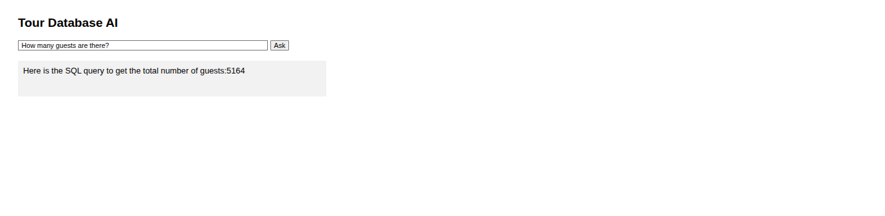
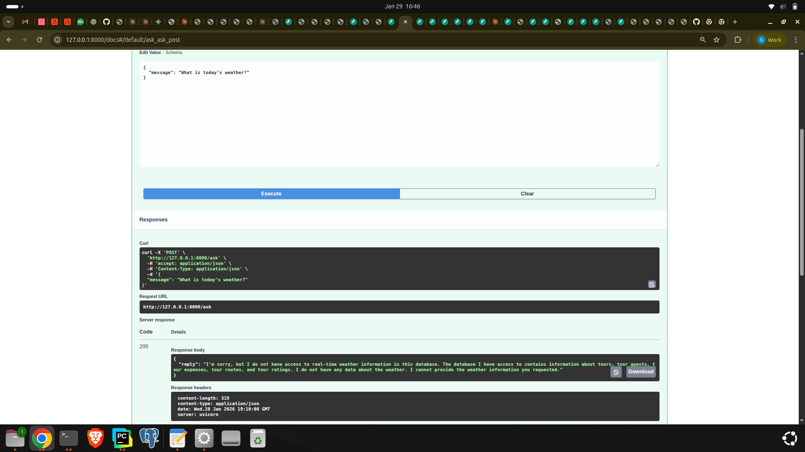
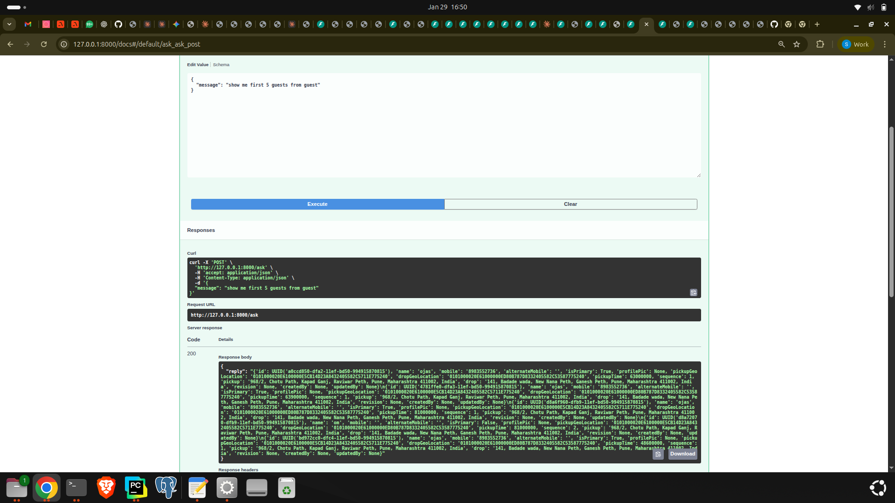

# AI Agents Portfolio
This repository contains two AI-powered projects that demonstrate how Large Language Models can be combined with tools, databases, and APIs to build practical AI agents.

These projects focus on:
- Natural language → SQL query generation
- Tool usage by agents
- AgentOS integration
- API + Web UI + Database connectivity
- Handling real-world user queries and edge cases

-------------------------------------------------------------------------------------------------------------------------------------------------------------------------------------------------------------------------
## Projects Overview

## Project 1 — My Personal AI (Natural Language → SQL)

This project allows a user to ask questions in plain English and the AI:

1. Understands the query
2. Generates the correct SQL
3. Executes it on PostgreSQL
4. Returns the result

It includes:
- FastAPI backend
- Web UI (HTML)
- SQLAlchemy + PostgreSQL
- AI-driven SQL generation
- Graceful handling of invalid queries

### Web UI



---

### FastAPI Endpoint Working



---

###AI Generating SQL Query


---

### SQL Query Result from Database



----
### Handling Invalid / Unclear Queries Gracefully


---
------------------------------------------------------------------------------------------------------------------------------------------------------------------

## Project 2 — PostgreSQL Agent using AgentOS

This project demonstrates how to build a database agent that runs inside **AgentOS** and is visible from the official dashboard.

The agent:
- Connects to PostgreSQL
- Uses tools to run SQL queries
- Is accessible from https://os.agno.com
- Shows tool usage, sessions, and traces

### AgentOS Dashboard View

*(You can add screenshots later from AgentOS if needed)*

------------------------------------------------------------------------------------------------------------------------------------------------------------------

## Technologies Used

- Python
- FastAPI
- SQLAlchemy
- PostgreSQL
- AgentOS (Agno)
- Claude Haiku model
- HTML (simple UI)

------------------------------------------------------------------------------------------------------------------------------------------------------------------

## How to Run

### For `my_personal_ai`

```bash
cd my_personal_ai
pip install -r requirements.txt
python main.py
